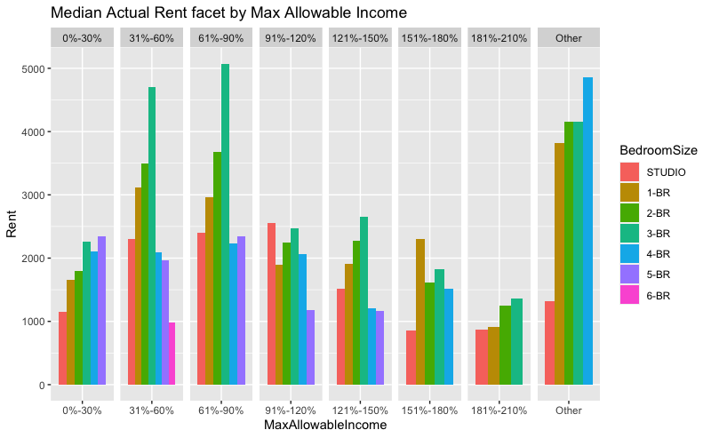

# Results


```{r}
proj = read.csv("Housing_New_York_Units_by_Building.csv", stringsAsFactors = TRUE, na.strings=c("----", "","NA"))
project = proj
rent = read.csv("Local_Law_44_-_Unit_Income_Rent.csv", stringsAsFactors = TRUE, na.strings=c(" ", "","NA"))
```

```{r}
library(forcats)
rent$MaxAllowableIncome = fct_relevel(rent$MaxAllowableIncome, "0%-30%", "31%-40%", "41%-50%", "51%-60%", "61%-65%", "66%-70%", "71%-80%", "81%-90%", "91%-100%")
rent$MedianActualRent = as.numeric(gsub(",", "", rent$MedianActualRent))
```

```{r}
# remove columns that around or more than 50% values are NAs
project = subset(project, select = -c(BIN) )

# remove rows with NAs
project = na.omit(project)
rent = na.omit(rent)

# drop unused levels and reorder levels
rent$BedroomSize = droplevels(rent$BedroomSize)
rent$BedroomSize = fct_relevel(rent$BedroomSize, "STUDIO")

# merge two data sets together
data = merge(project, rent, by.x = "Building.ID", by.y = "BuildingID")

# remove outliers with an extreme large rent
#boxplot(data$MedianActualRent)
#head(sort(data$MedianActualRent, decreasing = T), 10)
data = data[-which.max(data[, "MedianActualRent"]),]
```

```{r}
subdf = data[, c("Borough", "MedianActualRent", "BedroomSize")]
bor = c(rep("Staten Island", 2), "Bronx", "Manhattan", "Staten Island", "Bronx", "Manhattan", "Queens", "Staten Island")
mar = rep(0, 9)
bs = c("3-BR", "4-BR", rep("5-BR", 3), rep("6-BR",4))
add2 = data.frame(bor, mar, bs)
names(add2) = c("Borough", "MedianActualRent", "BedroomSize")
subdf2 = rbind(subdf, add2)
subdf2$Borough = as.factor(subdf2$Borough)

ggplot(subdf2, aes(BedroomSize, MedianActualRent, fill = Borough)) +
  geom_bar(position = "dodge", stat = "identity") + 
  labs(title = "Median Actual Rent facet by Bedroom size", x = "Bedroom Size", y = "Rent") +
  facet_grid(.~BedroomSize, scales = "free_x", space = "free")
```

According to this bar plot, among apartments with the same bedroom size, apartments in Mahattan have the highest median rent. Also, within a particular borough, the rent of apartments with 3 bedrooms have the highest median rent (except for Bronx). The rent of apartments with less than 4 bedrooms has an increasing trend as the number of bedrooms increase, while apartments with 4 or more bedrooms have lower rent. This shows that apartments in Mahattan have higher rent on average, and apartments with less than 4 bedrooms are more popular in the rental market in New York.

```{r}
ggplot(data, aes(Borough, MedianActualRent, fill = Reporting.Construction.Type)) +
  geom_bar(position = "dodge", stat = "identity") + 
  labs(title = "Median Actual Rent facet by Borough", y = "Rent") +
  facet_grid(.~Borough, scales = "free_x", space = "free")
```

As shown in the plot, all apartments in this dataset are categorized as new construction or preservation. From the plot, we could see that preserved apartments have higher median rent than new constructed apartments. Difference in rent between the two categories is the largest in Manhattan, and smallest in Bronx and Staten Island. Since people may worried that new constructed aparments have air polution, or the apartments may located far from downtown, the rent of new constructed apartments may results in lower rent.

```{r}
library(ggridges)
ggplot(data, aes(MedianActualRent, Prevailing.Wage.Status)) +
  geom_density_ridges() + 
  labs(title = "Median Actual Rent vs Prevailing Wage", y = "Rent")
```

All apartments in this data set are categorized into two groups according to whether they are subject to the prevailing wage requirements. From the plot, we could see that apartments that are subject to the requirements have higher mean than other apartments. The median rent of apartments without prevailing wage requirements are mainly in between 800 and 1100 dollars, while the median rent for other apartments has a larger range. This matches our intuition: in order to pay give prevailing wage to its service workers, some apartments might need to request a higher rent.


## Analysis on Number of Projects by Time

Walking on the streets of New York, we often find scaffolding on the side of the road, which means that the building near us is being built or remodeled. This kind of construction or reconstruction are happening in many places at the same time every day. We want to explore the changes in such projects in different statuses over previous several year in various aspects and to understand the pattern of apartments in New York so that we can have a better view about changes in this city over years.

```{r}
library(tidyverse)
library(dplyr)
library(ggplot2)

proj$Project.Start.Date = as.Date(proj$Project.Start.Date, format ="%m/%d/%Y")
proj$Project.Completion.Date = as.Date(proj$Project.Completion.Date, format ="%m/%d/%Y")

theme_dotplot <- theme_bw(13) +
    theme(axis.text.y = element_text(size = rel(.75)),
        axis.ticks.y = element_blank(),
        axis.title.x = element_text(size = rel(.75)),
        panel.grid.major.x = element_blank(),
        panel.grid.major.y = element_line(size = 0.5),
        panel.grid.minor.x = element_blank())

project_start = data.frame("Year" = as.Date(cut(proj$Project.Start.Date, breaks = "year")), 
                         "Project" = proj$Building.ID)
project_start = project_start %>%
  group_by(Year) %>%
  count()
project_end = data.frame("Year" = proj$Project.Completion.Date, 
                         "Project" = proj$Building.ID)
project_end = project_end %>% drop_na()
project_end$Year = as.Date(cut(project_end$Year, breaks = "year"))

project_end = project_end %>%
  group_by(Year) %>%
  count()

plot2 = merge(project_start, project_end, by = "Year", all.x = TRUE)
plot2[is.na(plot2)] = 0

tidydf = plot2 %>%
  rename(Start = "n.x", Complete = "n.y",) %>%
  gather(key = "Type", value = "Number", "Start", "Complete")
tidydf$Year = as.Date(cut(tidydf$Year, breaks = "month"))

ggplot(tidydf, aes(Number, Year, color = Type)) +
  geom_point() + 
  #scale_y_date(date_breaks = "1 year", date_minor_breaks = "1 month", date_labels = "%Y") +
  ggtitle("Number of projects started and completed each year 2014-2020") + 
  ylab("") +
  theme_dotplot +
  coord_flip()
```

From the dot plot on number of projects started and completed, we first notice that the number of projects started are roughly the same for previous 5 years and 2018 has highest number of projects started. The trend of number of projects completed has an obvious pattern: except for 2020, the number of projects completed increases by year. When carefully look into the data plot, we also see that the year of 2020 has the lowest number both on projects started and completed. There are two potential reasons. First, our data set has records up to 2020-09, meaning that, compared with previous years, 2020 have three more months to have projects started or completed so that the two dots can be higher in the plot if we review this plot after several months. However, However, based on the current data, even if the last three months of 2020 are recorded, the number of projects are still much smaller than previous years. Therefore, the second reason is that, the current COVID-19 situation has largely affected the process of each project.

In order to verify our conjecture, we separate each dot in previous plot into 12 dots, each representing a month. To avoid having too many data points at the same plot, we plot number of project of started and completed into two different plots.


```{r}
project_num = data.frame("Year" = as.Date(cut(proj$Project.Start.Date, breaks = "month")), 
                         "Project" = proj$Building.ID)

project_num_2 = data.frame("Year" = as.Date(cut(proj$Project.Completion.Date, breaks = "month")), 
                         "Project" = proj$Building.ID)
project_num_2 = na.omit(project_num_2) 


project_num_df = project_num %>%
  group_by(Year) %>%
  count()

project_num_df_2 = project_num_2 %>%
  group_by(Year) %>%
  count()

#project_num_df_2

ggplot(data = project_num_df, aes(x = Year, y = n, label = Year)) + 
  geom_line() +
  geom_point() +
  #geom_text() +
  #geom_text(size=0.5) + 
  annotate(geom="text", x=as.Date("2014-06-01"), y=219, label="2014-06",
              color="black") +
  annotate(geom="text", x=as.Date("2014-12-01"), y=182, label="2014-12",
              color="black") +
  annotate(geom="text", x=as.Date("2015-06-01"), y=238, label="2015-06",
              color="black") +
  annotate(geom="text", x=as.Date("2015-12-01"), y=159, label="2015-12",
              color="black") +
  annotate(geom="text", x=as.Date("2016-06-01"), y=304, label="2016-06",
              color="black") +
  annotate(geom="text", x=as.Date("2016-12-01"), y=113, label="2016-12",
              color="black") +
  annotate(geom="text", x=as.Date("2017-06-01"), y=335, label="2017-06",
              color="black") +
  annotate(geom="text", x=as.Date("2017-12-01"), y=64, label="2017-12",
              color="black") +
  annotate(geom="text", x=as.Date("2018-06-01"), y=239, label="2018-06",
              color="black") +
  annotate(geom="text", x=as.Date("2018-12-01"), y=88, label="2018-12",
              color="black") +
  annotate(geom="text", x=as.Date("2019-06-01"), y=375, label="2019-06",
              color="black") +
  annotate(geom="text", x=as.Date("2019-12-01"), y=91, label="2019-12",
              color="black") +
  annotate(geom="text", x=as.Date("2020-03-01"), y=125, label="2020-03",
              color="black") +
  annotate(geom="text", x=as.Date("2020-06-01"), y=72, label="2020-06",
              color="black") +
  scale_x_date(date_breaks = "1 year", date_minor_breaks = "1 month", date_labels = "%Y") +
  xlab("Year") +
  ylab("Number of Buildings Started") +
  ggtitle("Number of Buildings Started per Month 2014/01-2020/06") +
  theme_grey(13)

ggplot(data = project_num_df_2, aes(x = Year, y = n, label = Year)) + 
  geom_line() +
  geom_point() +
  #geom_text() +
  #geom_text(size=0.5) + 
  annotate(geom="text", x=as.Date("2014-06-01"), y=41, label="2014-06",
              color="black") +
  annotate(geom="text", x=as.Date("2015-06-01"), y=38, label="2015-06",
              color="black") +
  annotate(geom="text", x=as.Date("2015-12-01"), y=89, label="2015-12",
              color="black") +
  annotate(geom="text", x=as.Date("2016-06-01"), y=62, label="2016-06",
              color="black") +
  annotate(geom="text", x=as.Date("2016-12-01"), y=104, label="2016-12",
              color="black") +
  annotate(geom="text", x=as.Date("2017-06-01"), y=243, label="2017-06",
              color="black") +
  annotate(geom="text", x=as.Date("2017-12-01"), y=52, label="2017-12",
              color="black") +
  annotate(geom="text", x=as.Date("2018-07-01"), y=111, label="2018-07",
              color="black") +
  annotate(geom="text", x=as.Date("2018-12-01"), y=79, label="2018-12",
              color="black") +
  annotate(geom="text", x=as.Date("2019-06-01"), y=206, label="2019-06",
              color="black") +
  annotate(geom="text", x=as.Date("2019-12-01"), y=60, label="2019-12",
              color="black") +
  scale_x_date(date_breaks = "1 year", date_minor_breaks = "1 month", date_labels = "%Y") +
  xlab("Year") +
  ylab("Number of Buildings Completed") +
  ggtitle("Number of Buildings Completed per Month 2014/01-2020/06") +
  theme_grey(13)
```

From the data we can see that, in the year of 2020, the trend before April is quite similar with that of previous years in both starting and completion plots. The number of projects started is even much larger in March than previous years. It makes sense because in previous plot we see an increasing trend in number of projects started by year. To have larger number projects started in 2020 we need to have larger number in each Month. However, the number drops a lot in April for both projects started and completed, which is the time COVID-19 situation becomes serious in NYC. Therefore, our thoughts that the process of projects is largely affected by the epidemic is confirmed here.

We can also see an interesting pattern in these plots: the projects are mostly started in June and December, and the number started in June is larger than December. Similarly in plots with number completed, the projects are largely completed in summer and winter. Our explanation is that projects usually take 6 months or a whole year. But more rigorous analysis requires some domain knowledge in other fields such as architecture.

## Analysis of the Median Actual Rent of the building

In the discussion of house property, price is absolutely what people concerned the most. What is the relationship with the house rent price, the bedroom size of the house and the Income level?

```{r pressure, echo=FALSE,out.width = "80%",fig.align='center'}

```

Max Allowable Income known as MAI, refers to income limit for an affordable housing program with the maximum amount of income a household can earn to qualify to receive assistance. AMI that lower than 30% represents the extremely low income, 40% - 90% represents low income, 90% - 120% represents moderate income, 130% - 160% represents middle income, and > 170% represents high income. According to this graph, we observe that the family with MAI percentage lower than 90% are more likely to live in the houses with 3-4 bedrooms in NYC. The same bedroom size houses percentage decrease dramatically for family with MAI of 91% and higher percentage. At the same time, the studio percentage owned by 91% - 120% MAI increases a lot. For MAI percentage higher than 170%, we could see the disappear of 5- or 6-bedroom houses. So even the whole unit price of 4-6-bedroom houses is high, but it is more economical for a large family. And we discover that moderate income family are more likely to rent studio, which might because of the out-of-state students/single white collar who work in NYC.
